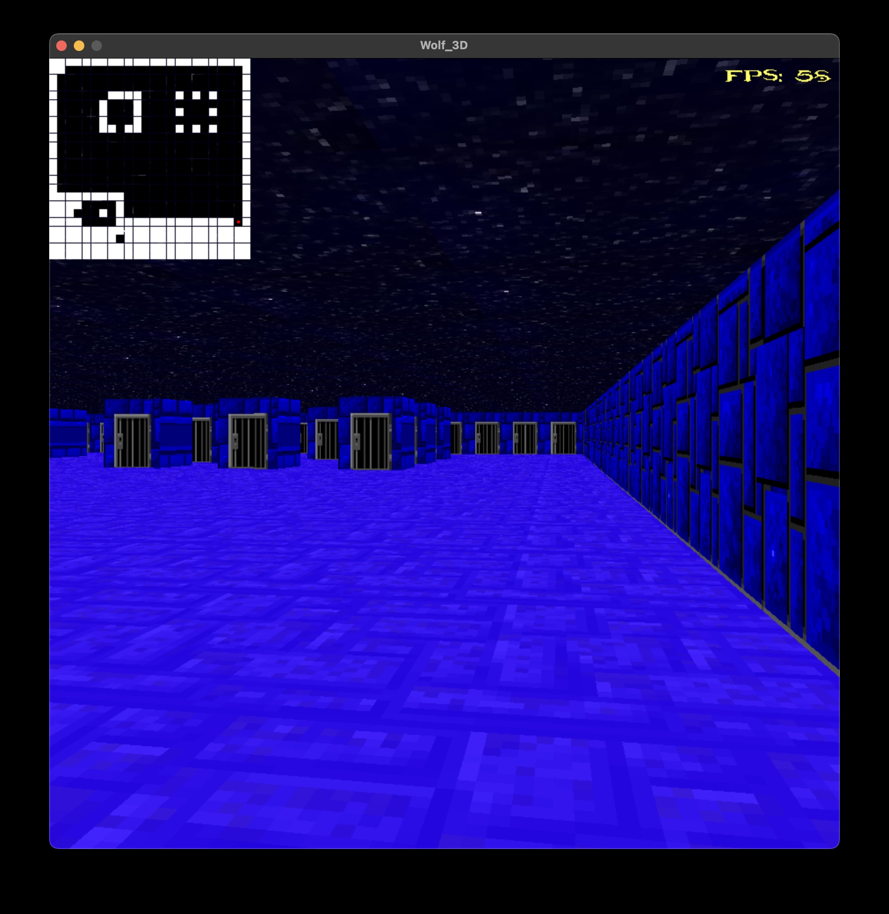

# 1337 Coding Scool (42 Network)

## Wolf3d

This project is a 3D graphically “realistic” representation that we could have
from inside a maze in a subjective view. This representation uses the
Ray-Casting, and my first interaction with SDL2 libraries.

### Requirements

* The management of your window must remain smooth: passing over of another
window, minimization, etc.
* Pressing ESC must close the window and quit the program cleanly.
* Clicking on the red cross on the window’s frame must close the window
and quit the program cleanly.
* The arrows on the keyboard must allow you to move in real time in the maze,
like in the original game.
* The wall’s colors must vary depending on the direction
(North, South, East, West).
* Wall collisions
* A skybox
* Floor and/or ceiling texture

## Getting Started

### Compiling

Run the following commands:

* To compile
	- `make`
* To remove objects:
	- `make clean`
* To remove objects and binary file (program):
	- `make fclean`

* To re-compile:
	- `make re`

### Executing

To run the program:

`./wolf3d`

## Screenshots

# Home 

# Select Texture

# First Wall Texture 

# Second Wall Texture 

# Third Wall Texture 

